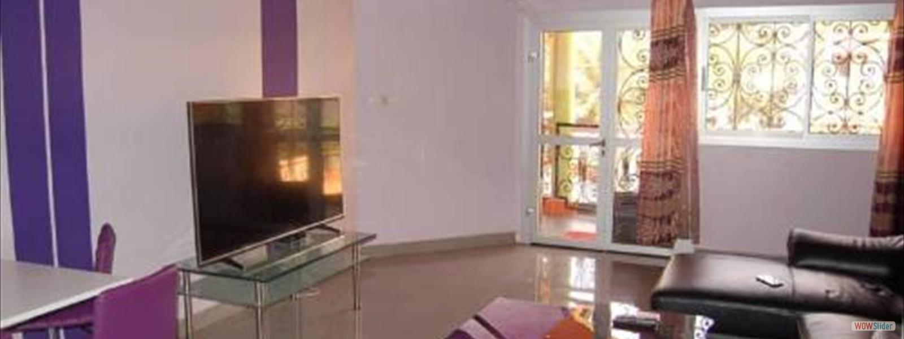
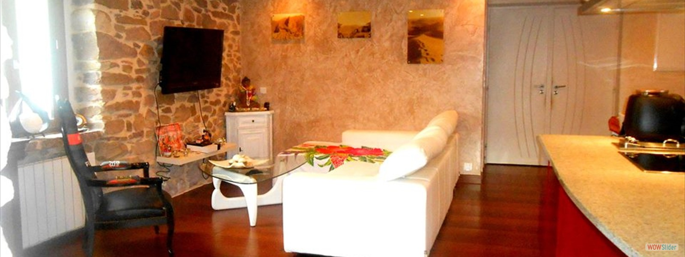
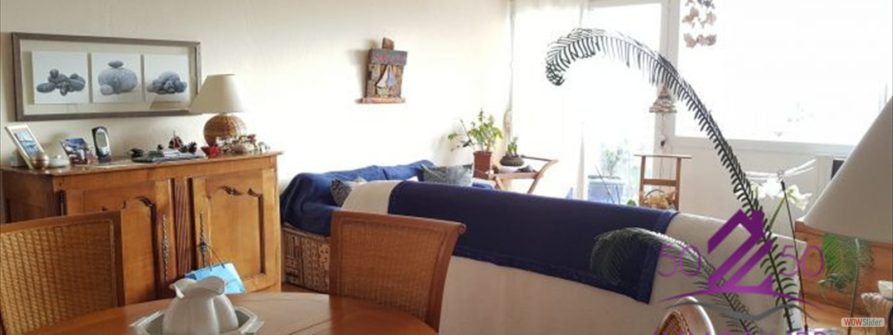
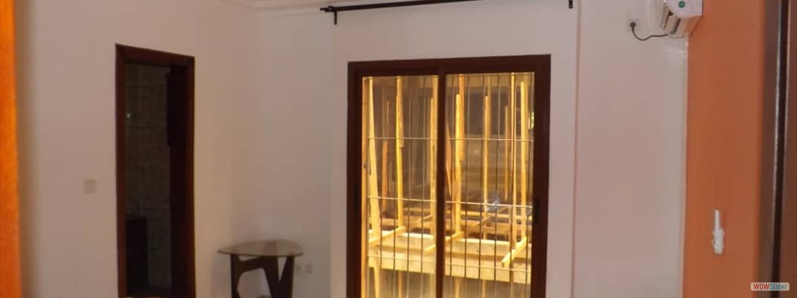
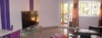
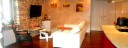
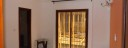
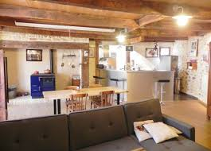
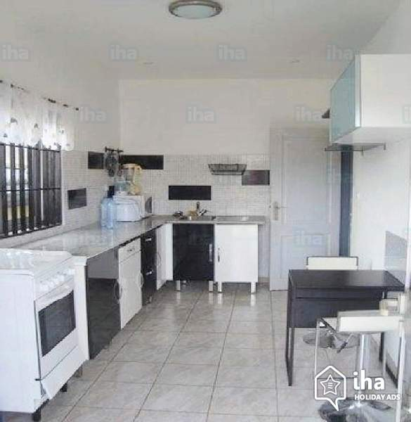

# ImmobilierCamer
TTFR
<html>
    <meta charset="utf-8">
    <head>
        <title> ImmobilierCamer </title>
        <!-- Start WOWSlider.com HEAD section -->
<link rel="stylesheet" type="text/css" href="engine1/style.css" />

      <!-- End WOWSlider.com HEAD section -->
      <link rel="stylesheet" type="text/css" href="menu.css">
    </head>
    <body>
    	

		<ul>
			<li class="svice"><a href="">accueil</a></li>
			<li class="svice"><a href="">service</a></li>

			<li class="svice"><a href="">a_propos_de_nous</a></li>
			<li class="id" ><a href="">
<input  type="button" class="ins" value="s'inscrire   -->"></a>	
		</ul> 
	

        <!-- Start WOWSlider.com BODY section -->

        
<ul>
                <li></li>
                <li></li>
                <li></li>
                <li></li>
            </ul>

            

                <a href="#" title="un magnifique salon pas cher au cameroun">1</a>
                <a href="#" title="un magnifique salon pqs cher au cameroun">2</a>
                <a href="#" title="une vie paisible et pas chere au cameroun">3</a>
                <a href="#" title="de beaux appartements situes en plein centre ville">4</a>
            

<a href="http://wowslider.net">bootstrap carousel example</a> by WOWSlider.com v8.8

        

        
	
        
        
        <!-- End WOWSlider.com BODY section -->
        

            
Depuis sa creation en 1999, le site "ImmobilierCamer a ete la reference par exellence pour l'immobilier dans notre pays le cameroun. ce site est recherche pour sa qualite de confier ses abones a de bon mobilier et dans la securite la plus total ! je vous exhorte ainsi a vous abonner a ce site car je peutvous garantir que vous y trouverez toujour satisfaction dans vos besoin"

          
        

        

            <aside class="aside1">
                
            </aside>
            <aside class="aside2">
                    
            </aside>
            <aside class="aside3">
                    
            </aside>
        

        

    </body>
</html>
